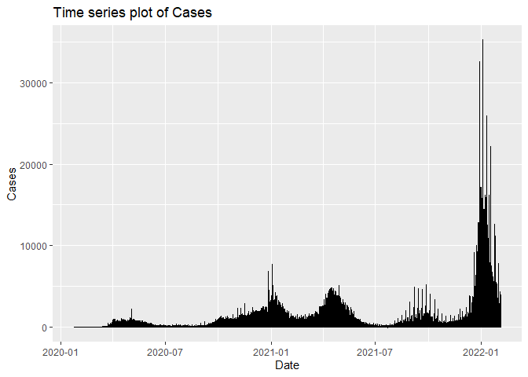

<!-- README.md is generated from README.Rmd. Please edit that file -->

# CovidTrackerR

<!-- badges: start -->

[](https://github.com/UBC-MDS/Group28-CovidTracker-R/actions)
[](https://codecov.io/gh/UBC-MDS/Group28-CovidTracker-R)
<!-- badges: end -->

CovidTrackerR provides basic data cleaning, wrangling and plotting of
Covid tracking data in Canada.

## Functions

The CovidTrackerR package is designed for the easy retrieval and
analysis of data pertaining to Covid trends in Canada, including
information about cases, vaccinations and testing. The package serves as
a wrapper for the opencovid.ca [API](Ihttps://opencovid.ca/api/), and
provides additional helper functions for visualising the data, either as
a time series or in the form of a map.

-   #### `get_covid_data()`

    Retrieve cleaned and formatted data of specified type and within
    (optionally) provided time ranges and locations

-   #### `plot_time_series()`

    Function for plotting time series trends in Covid data, including
    options for trendlines and smoothing

-   #### `calculate_stat_summary()`

    Function for returning key statistical information about Covid data,
    such as long run trends and comparisons between provinces<br>

-   #### `plot_geographical()`

    Function for plotting choropleth maps with Covid data

## Installation

You can install the development version of CovidTrackerR from
[GitHub](https://github.com/) with:

``` r
# install.packages("devtools")
devtools::install_github("UBC-MDS/Group28-CovidTracker-R")
```

## Documentation

A vignette with full usage demonstration and function documentation can
be found here <https://ubc-mds.github.io/Group28-CovidTracker-R/>

## Usage and Examples

`CovidTrackerR` can be used to acquire covid data, generate choropleth
maps and time series plots, and compute summary statistics as follows:

``` r
library(CovidTrackerR)
```

``` r
covid_data <- get_covid_data('active', 'BC')
head(covid_data)
#>   active_cases active_cases_change cumulative_cases cumulative_deaths
#> 1            0                   0                0                 0
#> 2            0                   0                0                 0
#> 3            0                   0                0                 0
#> 4            1                   1                1                 0
#> 5            1                   0                1                 0
#> 6            1                   0                1                 0
#>   cumulative_recovered date_active province
#> 1                    0  25-01-2020       BC
#> 2                    0  26-01-2020       BC
#> 3                    0  27-01-2020       BC
#> 4                    0  28-01-2020       BC
#> 5                    0  29-01-2020       BC
#> 6                    0  30-01-2020       BC
```

``` r
covid_df <- get_covid_data()
plot_geographical(covid_df, cases)
```


``` r
plot_timeseries(covid_df,cases)
```



``` r
calculate_stat_summary(covid_df,'cases')
#>         province start_date   end_date count      sd min   max mean quantile_25
#> 1        Alberta 2020-01-25 2022-02-04   742 1367.72   0 17577  678        18.0
#> 2             BC 2020-01-25 2022-02-04   742  819.90   0  9332  445         0.0
#> 3       Manitoba 2020-01-25 2022-02-04   742  439.78   0  7083  165         1.0
#> 4  New Brunswick 2020-01-25 2022-02-04   742  138.91  -2  2548   40         0.0
#> 5             NL 2020-01-25 2022-02-04   742  131.86   0  1873   24         0.0
#> 6    Nova Scotia 2020-01-25 2022-02-04   742  159.77  -1  1184   53         0.0
#> 7        Nunavut 2020-01-25 2022-02-04   742   10.98   0   140    2         0.0
#> 8            NWT 2020-01-25 2022-02-04   742   34.90  -4   314    8         0.0
#> 9        Ontario 2020-01-25 2022-02-04   742 2906.25   0 35287 1430       205.0
#> 10           PEI 2020-01-25 2022-02-04   742   50.57   0   407   11         0.0
#> 11        Quebec 2020-01-25 2022-02-04   742 2328.17 -90 17122 1179       158.5
#> 12   Repatriated 2020-01-25 2022-02-04   742    0.20   0     4    0         0.0
#> 13  Saskatchewan 2020-01-25 2022-02-04   742  255.35   0  1979  163         9.0
#> 14         Yukon 2020-01-25 2022-02-04   742   16.17   0   197    4         0.0
#>    quantile_50 quantile_75 current_value
#> 1        212.0      787.50          2086
#> 2         75.5      586.25          1495
#> 3         53.5      174.50           620
#> 4          3.0       16.00           401
#> 5          0.0        3.00           258
#> 6          2.0       17.00           594
#> 7          0.0        0.00            44
#> 8          0.0        0.00           187
#> 9        551.0     1566.75          3959
#> 10         0.0        1.00           199
#> 11       655.5     1097.75          3400
#> 12         0.0        0.00             0
#> 13        73.0      222.00           771
#> 14         0.0        1.00            18
```

## Similar Packages

There are several R packges which have some overlapping functionality as
our package, but none which perform all the data acquisition, analysis
and graphing tasks which CovidTracker encompasses. The packages designed
for covid data retrieval also do not use the same data source as
CovidTracker and do not provide the same level of granularity. Some
examples of related R packages useful for Covid data retrieval and data
visualizations include:

-   [COVID19](https://cran.r-project.org/web/packages/COVID19/index.html) -
    For Covid data retrieval
-   [covdata](https://github.com/kjhealy/covdata/) - For Covid data
    retrieval
-   [ggplot2](https://cran.r-project.org/web/packages/ggplot2/index.html) -
    For data visualizations
-   [tmap](https://cran.r-project.org/web/packages/tmap/index.html) -
    For choropleth data visualizations
